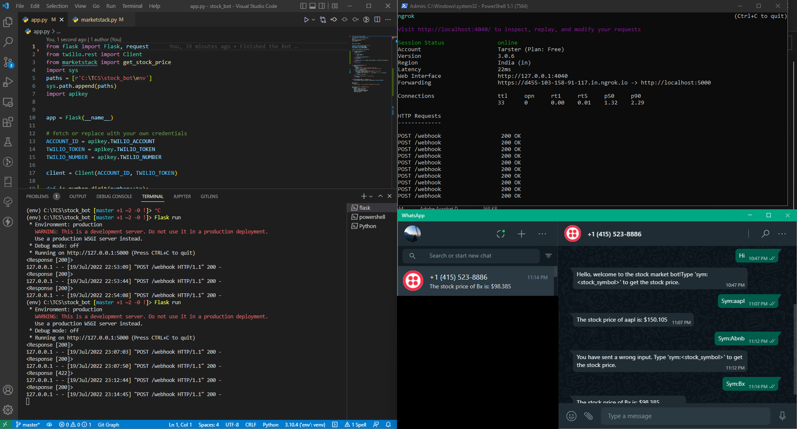

# WHATSAPP STOCK BOT USING TWILIO, FLASK & NGROK
This is a whatsapp stock bot that fetch the intraday latest stock price from the **marketstack** website using the api.

To run this bot please replace the **constants** with your own private keys, please either pass your own path or just comment the path line and substitute your own values in the place.

This app use flask and ngrok as well.

Flask servers as the backend while ngrok will forward the localhost 5000 port.

